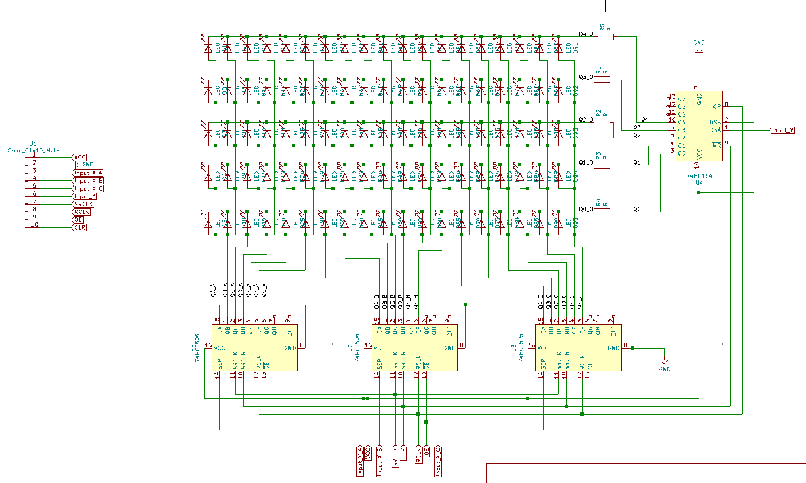
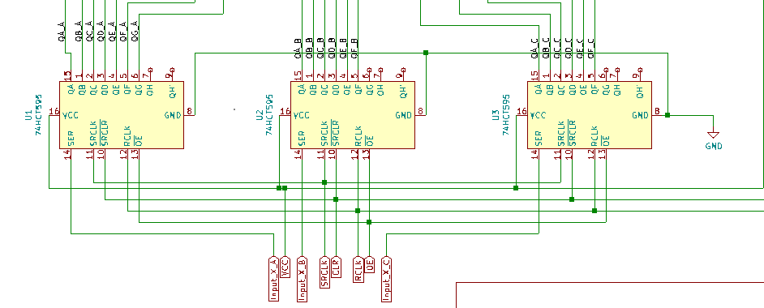
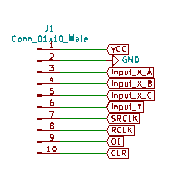
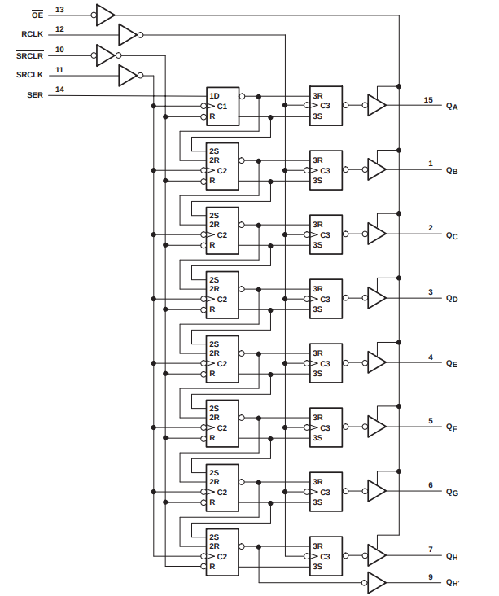
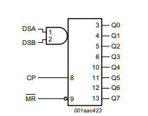

# LED Matrix Project Documentation

## PCB Design

### Layout

Dimensions:
Width: 158.15mm
Height: 45.977mm

### Schematics 

## Hardware

### 74HC595 Shift Register

### 74HC164 Shift Register

.
